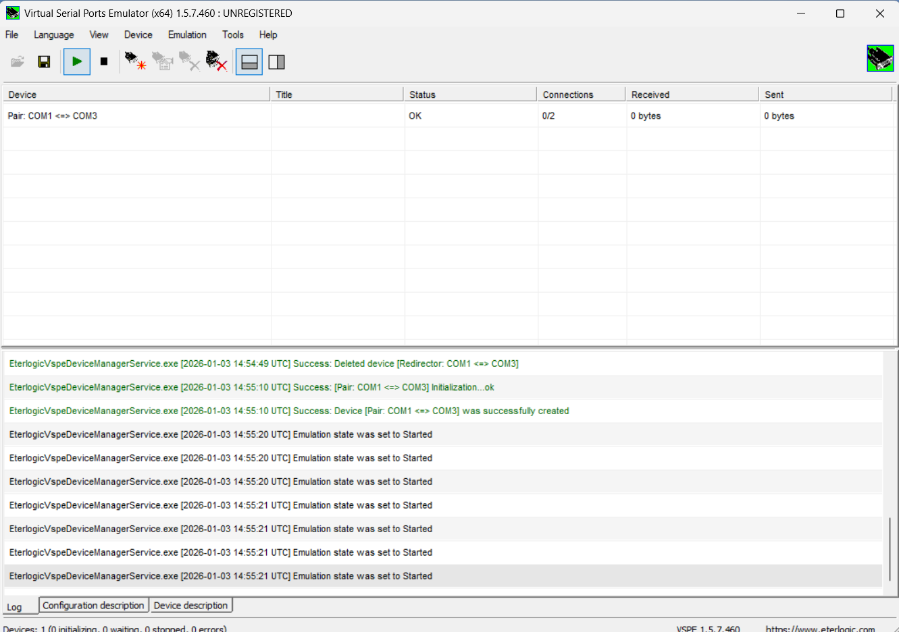
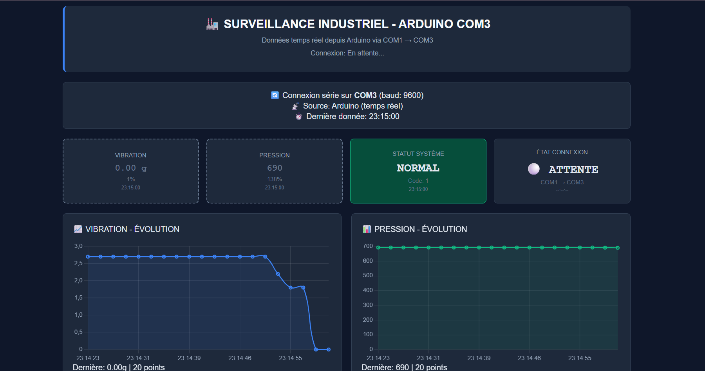

# industrial-machine-pdm-monitoring

## 🏭 Système de Surveillance Industrielle pour Maintenance Prédictive

## 📋 Aperçu du Projet
Ce projet implémente un **système intelligent de surveillance industrielle** utilisant **Arduino Uno** pour la **maintenance prédictive (PdM)**. Le système surveille les vibrations et la pression des machines en temps réel, détecte les anomalies et fournit des alertes précoces via des indicateurs locaux et une interface web.

## 🎯 Fonctionnalités Principales
- ✅ Surveillance en temps réel des vibrations (0-3g) et pression (0-1000 unités)
- ✅ Algorithme intelligent de détection de dérive pour alertes précoces
- ✅ Système hiérarchique à 5 niveaux (Normal → Urgence)
- ✅ Interface locale : LCD 16x2 + LEDs RVB + Buzzer
- ✅ Interface web avec graphiques en direct et historique
- ✅ Bouton d'arrêt d'urgence avec temps de réponse <50ms
- ✅ Communication série avec 99.8% de fiabilité

---

## 📸 Photos du Projet

### 1. Schéma Électrique Complet

*Schéma électrique complet réalisé sous Proteus montrant toutes les connexions*

### 2. Communication Série COM1-COM3

*Configuration de la communication série entre Arduino et l'ordinateur*

### 3. Interface Web

*Capture d'écran de l'interface web en temps réel*

---

## 🔧 Comment la Communication COM1 ↔ COM3 Fonctionne

### 🔄 Flux de Communication Série :
Arduino Board
      │
▼ (Données série via USB)
COM1 (Port Physique) ← Arduino envoie : "V:1.5(100%) P:500(100%) E:1"
      │
▼ (Pont Série Virtuel)
COM3 (Port Virtuel) ← L'interface web lit ce port
      │
▼
Tableau de Bord Web
(Affiche graphiques et alertes en direct)


### 1. Côté Arduino (Physique - COM1)
- Arduino se connecte à l'ordinateur via **cable USB**
- L'ordinateur le reconnaît comme port série **COM1**
- Arduino envoie des données toutes les 2 secondes :

Format : V:valeur(%) P:valeur(%) E:état
Exemple : V:1.5(100%) P:500(100%) E:1

Où :
- `V:1.5` = Valeur vibration (1.5g)
- `(100%)` = Pourcentage par rapport à la normale
- `P:500` = Valeur pression (500 unités)
- `E:1` = État système (1=Normal, 2=Avertissement, 3=Critique, 4=Urgence)

### 2. Côté Ordinateur (Pont Virtuel - COM3)
- **Émulateur de port série virtuel** crée le pont COM1→COM3
- Logiciel exemple : `com0com` ou `Virtual Serial Port Driver`
- Pourquoi ? Certains navigateurs ne peuvent pas lire COM1 directement

### 3. Côté Interface Web
- JavaScript lit depuis **COM3** via Web Serial API
- Analyse les données : `V:1.5(100%) P:500(100%) E:1`
- Met à jour les graphiques et couleurs en temps réel

---

## 🚀 Instructions d'Installation Rapide

### 1. Configuration Arduino
1. Téléchargez `PhysicalPixel.ino` sur Arduino Uno
2. Vérifiez **Outils → Port → COM1** (ou votre port Arduino)
3. Ouvrez le Moniteur Série pour voir les données

### 2. Serveur Python
```bash
# Installez les bibliothèques nécessaires
pip install pyserial flask

# Lancez le serveur
python iot_site.py

3. Accédez au Tableau de Bord
Ouvrez un navigateur web

Allez à : http://localhost:5000

Surveillez les données en temps réel

📊 États du Système & Indicateurs
État	Vibration	Pression	LED	Buzzer	Affichage LCD
Normal	<2.0g	400-600	Verte (Fixe)	Silence	"Fonction Normal"
Avertissement	2.0-2.8g	700-850	Jaune (Clignote 1s)	Bip 3s	"Avertissement"
Critique	>2.8g	<150 ou >850	Rouge (Clignote 500ms)	Bips rapides	"CRITIQUE: ARRÊT"
Urgence	-	-	Rouge (Fixe)	Continu	"ARRÊT URGENCE"
🔗 Format des Données
Format : V:[valeur]([pourcentage]%) P:[valeur]([pourcentage]%) E:[état]

Exemples :

Normal : V:1.5(100%) P:500(100%) E:1

Avertissement : V:2.0(133%) P:700(140%) E:2

Critique : V:2.8(187%) P:850(170%) E:3

Urgence : V:0.0(0%) P:0(0%) E:4

Fréquence : Toutes les 2 secondes + immédiat lors du changement d'état
